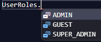
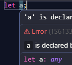

# DataTypes -

Type : what kind of data a variable can hold

```js
let a = 12;
let b = a;
b += 2;
console.log(a + " " + b); // 12 14
// a remain unchanged
```
---
## <center> Primitives
The most basic types in TypeScript are called primitives.
```ts
// BOOLEAN
let isActive = true;

// NUMBER
let decimal = 6;
let hex = 0xf00d;
let binary = 0b1010;
let octal = 0o744;      
let float = 3.14;      

//STRING
let color = "blue";
let fullName = 'John Doe';

// BIGINT : Whole numbers larger than 2^53 - 1.
const hugeNumber = BigInt(9007199254740991);

// SYMBOL : creates unique identifiers


```


## <center> References [ ] { } ( )

In **Refrences**, If changes made in `b` => will affect `a`
```js
let a = [1, 2, 3, 4, 5];
let b = a;
b.pop();
console.log(a + " " + b); //1234 1234
```

#### 1. ARRAYS :-
```JS
let a = [1,2,3,4,5, "AYUSH"]; 
//If hover will show a:(number|string)[]

let numbers: number[] = [1, 2, 3];
let names: Array<string> = ["A", "B"];
```

#### 2. TUPLES :-
```js
let tup:[string, number] = ["Ayush", 69]
```

#### 3. ENUM :-
```ts
enum UserRoles {
    ADMIN = "aditi",
    GUEST = "ayush",
    SUPER_ADMIN = "daddy"
}
```
  

## <CENTER>MORE TYPES

### ANY :-
Turns off TypeScript safety,  
   

```ts
let value: any = 10;
value = "hello"; // allowed (no safety)
```
---
### UNKNOWN :-  
Forces you to check type before using it
```ts
let value: unknown = 10;

if (typeof value === "string") {
  console.log(value.toUpperCase());
}
```

---
### FUNCTIONS :-

```ts
function add(a: number, b: number): number {
  return a + b;
}
```

---
### NULL :-
