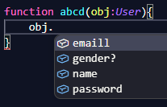

# INTERFACE
```ts
interface User {
    name: string,
    emaill: string,
    password: string,
    gender?: string //Optional Properties (?)
}
```


---
# TYPE
```js
// js
let user = {
  name: "Ayush",
  age: 22
};
```

```ts
// ts but repetitive
let user: { name: string; age: number } = {
  name: "Ayush",
  age: 22
};  
```

```ts
//cleaner
type User = {
  name: string;
  age: number;
};

let user1: User = {
  name: "Ayush",
  age: 22
};
```

---
Use interface → for objects (default choice)  
Use type → for flexibility (unions, combos later)

